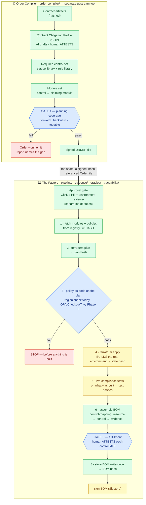
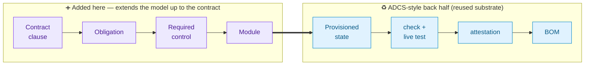
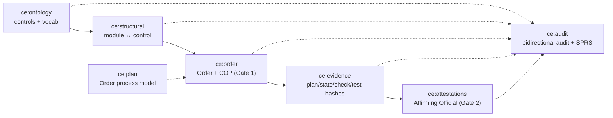
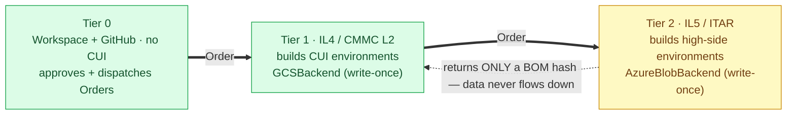
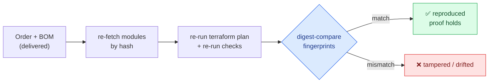

# Architecture

The engine is a **provisioning loop** — the environment is built from an Order and the proof falls out of the build — running on the [`ADCS-lifecycle-demo`](../ADCS-lifecycle-demo) traceability substrate. Per-module detail lives in each directory's `DESIGN.md`.

> **Design of record (end-state).** This document describes the full target architecture. For what is *implemented today* vs. deferred, see [`docs/AS-BUILT.md`](docs/AS-BUILT.md). In the diagrams below, **🟩 green = runs today** and **🟨 amber = Phase II (mocked or deferred today)**. Every current run is fixture-backed and stamped **NON-EVIDENTIARY**.

## 1. The two systems and the seam between them

**Legend:** 🟩 runs today · 🟨 Phase II (mocked/deferred) · 🔷 gate · 🟥 hard stop. Today the Factory runs `terraform plan` at **preview level with mock providers** (no cloud, no credentials); **apply, live compliance tests, and Sigstore signing are Phase II**, and evidence is fixture-backed (→ NON-EVIDENTIARY).

The Compiler and the Factory are **decoupled by design** (chosen seam): the Factory's input is a signed Order file and nothing else. This keeps the Factory simple and lets Orders be produced, reviewed, and version-controlled independently.

## 2. Why the resources _actually_ fulfill the requirements — two gates

|              | Gate 1 — Planning coverage                                  | Gate 2 — Proven fulfillment                        |
| ------------ | ----------------------------------------------------------- | -------------------------------------------------- |
| **Where**    | Order Compiler, before anything is built                    | Factory, at BOM close                              |
| **Forward**  | every required control has a claiming module                | every required control comes back MET in the BOM   |
| **Backward** | every module traces to a required control (no orphan infra) | every attestation is backed by addressing evidence |
| **Guard**    | no claim without a testable method                          | MET only if evidence passes AND a human attests    |
| **Fail**     | Order won't emit                                            | BOM invalid                                        |

Bidirectional audit is the ADCS `traceability/audit.py` mechanism, applied at both gates. A control claim is a _promise_ at Gate 1 and a _receipt_ at Gate 2 — never a bare assertion.

## 3. The derivation chain (extends the ADCS model up to the contract)

ADCS derives `satellite req → ADCS req → design element → evidence → attestation`. We add the top segment (contract → module); the two segments form **one bidirectionally-audited chain**:

Every arrow is an explicit, content-addressed link. A gap anywhere is a hard fail, not a silent pass. That property — not any single check — is what makes "the infra actually maps to fulfillment" true.

## 4. The named-graph substrate (the back half)

Everything is held as an `rdflib.Dataset` of named graphs (ADCS pattern), one per layer. Data flows left-to-right; the audit graph reads from all of them:

_(named graphs shown without their `<…>` delimiters for diagram clarity; the table below uses the canonical `<ce:…>` form.)_

| Named graph         | Holds                                                  | Filled by                           |
| ------------------- | ------------------------------------------------------ | ----------------------------------- |
| `<ce:ontology>`     | `cmmc:` controls (Doc 1) + obligation/derivation vocab | `ontology/`                         |
| `<ce:plan>`         | the SOP/Order process model                            | `pipeline/plan.ttl`                 |
| `<ce:structural>`   | module ↔ control allocation                            | `structural/`                       |
| `<ce:order>`        | the Order + its COP derivation (Gate 1 record)         | `order-compiler/`                   |
| `<ce:evidence>`     | plan/state/check/test artifacts, hashed                | Factory steps 2–5                   |
| `<ce:attestations>` | Affirming Official determinations                      | Factory step 7                      |
| `<ce:audit>`        | bidirectional audit + SPRS scorecard                   | `traceability/audit.py` + `sprs.py` |

## 5. Verification vs. validation (the legal boundary)

- **Verification** = automated, fully-specified (policy checks, live tests, hash matches, SPRS math). `earl:automatic`. Safe to delegate to an agent; safe to re-run.
- **Validation** = human judgment (the Affirming Official's MET/NOT-MET call; the Compliance Officer's COP attestation). `earl:manual`. Carries FCA liability.

An agent may drive the entire Factory and draft the COP; it can never attest. Capability and accountability are separated by construction.

## 6. Tiered provisioning chain

Each tier provisions the next; sensitive data never flows _down_. Persistence is behind `backends/` with a fail-fast preflight, both write-once:

Phase I is **Tier 1 (IL4/CMMC)**; **Tier 2 (IL5/ITAR)** is the deferred high-side overlay. Tier 2 returns only a BOM hash to Tier 1 — the proof crosses the boundary, the CUI never does.

## 7. Re-executability (proof by reproduction)

The Factory captures the exact module hashes, plan, and state. An auditor takes the Order + BOM and **re-runs it** — rebuilding the identical environment and re-running the checks — then digest-compares:

This is the ADCS `compute.reproduce` loop retargeted from Docker images to Terraform: rebuild at the recorded reference, compare fingerprints, emit a match/mismatch assertion. (Today the loop re-runs at **plan level**; live rebuild-and-compare is Phase II.)

## 8. Bare now vs. bolted on later

- **Now:** bare SHA-256 (content identity).
- **Phase 2:** Sigstore cosign + Rekor (authenticity / non-repudiation of Orders and BOMs) — required before a C3PAO re-executes.
- **Phase 2+:** authority/credential model binding the Affirming Official's SPRS identity + role to each attestation.
