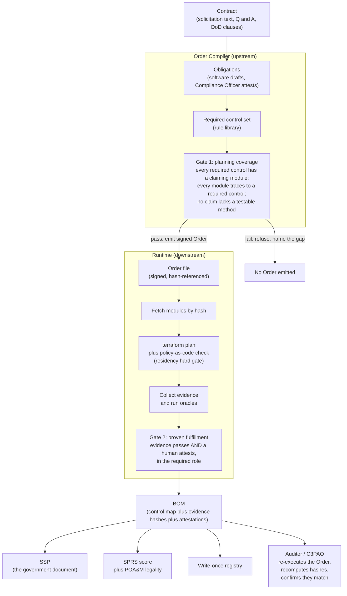

# Compliance Engine

The Compliance Engine ingests a signed description of what a contract requires and a signed set of statements about how an organization satisfies each requirement, and it emits a System Security Plan (SSP), a Bill of Materials (BOM) of the supporting evidence, and a Supplier Performance Risk System (SPRS) score. Every automated check, every piece of evidence, and every human sign-off is content-addressed and cross-linked, and no requirement is recorded as met until a named, role-appropriate human signs a statement to that effect.

The system targets CMMC Level 2 (the 110 security controls of NIST SP 800-171 Rev. 2) for U.S. defense contractors that handle Controlled Unclassified Information (CUI). It is written in Python over an RDF named-graph store, drives real Terraform at plan level, and produces byte-deterministic output from a given set of inputs.

## Honest limits (read first)

This repository is a working prototype. Before adapting it, understand what it does not yet do:

- **Every run today is non-evidentiary.** Evidence is fixture-backed and Terraform runs in plan/preview mode with mock providers. Every output carries an `evidentiary_status` of `mock`, `mock-plan`, or `attested-reference-mock`, and every generated SSP carries a `NON-EVIDENTIARY` banner. Nothing here is a submittable government artifact yet.
- **It does not make an organization compliant.** It records and organizes claims. If a claim is false, the engine will still pass it; a human signer carries the legal accountability, and an assessor will catch the discrepancy.
- **References are not resolved live yet.** The model assumes each control points at an authoritative source (a cloud API, a training system, a document repository). Today those references resolve against local files and fixtures; the live API resolvers are not built. References now carry a pinned version and a signature field for the signed-policy model, but the live resolvers are still future work.
- **Attestation signing is real, but the production key path is deferred.** The engine signs and verifies attestation records with real Ed25519 signatures today, and rejects a tampered or unverifiable signed record at load (fail-closed). The production cosign + FIPS-KMS path is implemented behind a probe and switches on when the cosign binary and KMS key are present. The demonstration runs unsigned (`sig_algo=none`, Git-history trust) and stays non-evidentiary.
- **The append-only tier of record is wired, but the live server is deferred.** A Flexo MMS backend persists each run to an append-only, versioned store (`--store-backend flexo`); it is offline-simulated here, with the local registry retained as the cache/fallback tier. Standing up a live in-enclave Flexo server is deferred.
- **It does not talk to SPRS.** SPRS has no public API. The engine computes the score; a human still enters it at the government portal.
- **The shipped policy documents are scaffolding.** The 16 files under `src/compliance_engine/documents/policies/` are placeholder text. An adopting organization must replace each with its own adopted, followed policy.

What is now real end to end, in addition to the two-machine flow below: full-chain provenance (contract to BOM/SSP, modeled with the P-Plan ontology and checked for SOP adherence), cryptographically-signed attestations, an append-only storage tier, and a single signed **audit package** (`uv run ce package` / `uv run ce verify-package`) that an assessor can re-verify offline. See [Roadmap and what is not built](#roadmap-and-what-is-not-built) for the full deferred list.

## Contents

- [Who this is for](#who-this-is-for)
- [The problem, in plain terms](#the-problem-in-plain-terms)
- [What makes this different from a checklist tool](#what-makes-this-different-from-a-checklist-tool)
- [The founding principle](#the-founding-principle)
- [Core vocabulary](#core-vocabulary)
- [How it works, end to end](#how-it-works-end-to-end)
- [The two coverage gates](#the-two-coverage-gates)
- [The attested-reference model in depth](#the-attested-reference-model-in-depth)
- [Coverage today](#coverage-today)
- [Repository layout](#repository-layout)
- [Installation and quickstart](#installation-and-quickstart)
- [The outputs, explained](#the-outputs-explained)
- [Operating the system (for compliance and operations staff)](#operating-the-system-for-compliance-and-operations-staff)
- [Extending the system (for engineers)](#extending-the-system-for-engineers)
- [The data model](#the-data-model)
- [Testing](#testing)
- [Roadmap and what is not built](#roadmap-and-what-is-not-built)
- [Where to go next](#where-to-go-next)

## Who this is for

This document serves two readers and explains the "how" for both.

- **Compliance and operations staff.** People responsible for the security program, the policies, the training records, and the eventual SPRS submission. The sections on the problem, the vocabulary, the end-to-end flow, and [operating the system](#operating-the-system-for-compliance-and-operations-staff) are written for this reader and assume no software background.
- **Engineers.** People who will run, modify, or integrate the system. The sections on the repository layout, [extending the system](#extending-the-system-for-engineers), the data model, and testing are written for this reader.

Read the shared sections (problem, vocabulary, flow, gates, coverage) first; both audiences need them.

## The problem, in plain terms

A defense contractor that handles CUI must meet CMMC Level 2: a fixed list of 110 security controls drawn from NIST SP 800-171 Rev. 2. To bid on and hold such contracts, the contractor must:

1. Produce a **System Security Plan (SSP)**: a document describing, control by control, how each of the 110 requirements is met.
2. Compute and file an **SPRS score**: a single number from -203 to 110. You start at 110 and subtract the weight (1, 3, or 5 points) of every control you have not met. Some controls are non-deferrable, meaning they cannot be listed on a corrective-action plan (a POA&M) and left for later.
3. Keep both current and be able to defend them to an assessor (a certified third party called a C3PAO, or a government reviewer for self-assessments).

In practice this is assembled by hand: screenshots, spreadsheets, and binders, refreshed in a scramble before each audit and stale the day after. The evidence that a control is met is disconnected from the document that claims it, and neither is connected to the system that actually enforces the control.

This engine changes the shape of that work. The SSP, the BOM, and the SPRS score are not written by hand; they are compiled from a structured, signed dataset. The dataset links each control to the thing that satisfies it, to the evidence for that thing, and to the human who signed off. Because the compilation is deterministic, an assessor can re-run it and confirm the numbers, rather than reading a binder and trusting it.

## What makes this different from a checklist tool

A checklist tool records, for each control, a status and a free-text note. This engine records, for each control, a resolvable pointer to the authoritative source where the truth of that control actually lives, and it applies a uniform check to that pointer.

Every control is claimed by a module. Every module names an authoritative source (a cloud API, a learning-management system, a human-resources system, a document repository) and a reference into that source. When the engine evaluates a control, it does not ask a person to remember a status; it checks that the reference is registered, that it resolves, that it is within its freshness window, and that a human in the required role has signed a statement covering it. If any of those conditions fails, the engine reports a specific, machine-readable reason: the reference is missing, or stale by a stated number of days, or awaiting a signature, or signed by the wrong role. The final judgment that a control is met is always a human act; the engine enforces the bureaucracy around that judgment, not the judgment itself.

This is the same mechanism for a control a machine can measure (a firewall rule) and a control only a human can attest (a completed training program). The difference between them is the kind of authoritative source and the kind of evidence, not a different code path. That uniformity is what lets the engine cover all 110 controls rather than only the machine-checkable subset.

## The founding principle

> Evidence does not verify requirements; evidence supports a human judgment that requirements are satisfied.

Machines provision infrastructure, gather evidence, and run automated checks. These are recorded as automatic assertions. A control is marked met only when a human, the Affirming Official, attests it, recorded as a manual assertion, and that person carries the legal accountability (under the False Claims Act and 18 U.S.C. section 1001 for false statements to the federal government). The same line governs the single judgment made on the input side: software drafts the contract's obligations, and a Compliance Officer attests them.

## Core vocabulary

Both audiences need these terms. They are used precisely throughout the codebase and this document.

- **Control.** One of the 110 CMMC Level 2 requirements, for example `AC.L2-3.1.1` ("limit system access to authorized users"). Each has a weight (1, 3, or 5) and a POA&M-eligibility flag.
- **Module.** A unit of the system that claims to satisfy one or more controls, for example a Terraform-provisioned VPC segment or an adopted incident-response policy. Modules live in the structural model.
- **Authoritative source.** The system that owns the ground truth for a class of evidence: a cloud API, a training system, an HR system, a document repository. The place "where it is actually recorded."
- **Reference.** A resolvable pointer into an authoritative source, carrying a URI, a freshness window, a last-verified timestamp, and a named custodian.
- **Attestation.** A signed statement by a named person, in a specific role, that a set of controls is met, covering a set of references, as of a specific date.
- **Role.** The capacity in which a person signs: Affirming Official, Security Officer, IT Administrator, or Operations. The Affirming Official may attest anything; other roles are bounded to their domain, which lets an assessor detect the wrong kind of person signing the wrong kind of evidence.
- **Oracle.** An automated check. The engine has a small number of oracle kinds: a config-check oracle for machine-measurable controls, and an attested-reference oracle for controls backed by a reference plus a signature.
- **Outcome.** The result of an oracle: `passed`, `failed`, `cantTell` (genuinely unknowable), or `needsAction` (a concrete, actionable gap such as a missing or stale reference). Every `needsAction` and `failed` carries a machine-readable reason.
- **Evidence.** A recorded observation that addresses a control. Evidence supports an attestation; it never, by itself, marks a control met.
- **Order.** A signed, hash-referenced file that states which controls a specific contract requires and which modules will satisfy them. It is the input to the runtime.
- **COP (Contract Obligation Profile).** The upstream description of a contract's obligations, from which the required-control set is derived and an Order is compiled.
- **BOM (Bill of Materials).** The generated, signed record mapping each required control to its module, its evidence hashes, and its attestation. The BOM's control-mapping is what the SSP renders.
- **SSP, SPRS.** The government-facing document and the government-facing score, both compiled from the dataset.
- **Evidentiary status.** A tag on every artifact recording how strong the evidence is: `mock`, `mock-plan`, and `attested-reference-mock` are all non-evidentiary (demonstration only); live statuses are future work.

## How it works, end to end

The system has two decoupled halves that exchange a single file. The upstream half (the **Order Compiler**) turns a contract into a signed Order. The downstream half (the **runtime**, historically called the Factory in the code) consumes an Order, provisions and checks the environment, and produces the signed outputs. An assessor can then re-execute the Order and confirm the outputs match.



In prose: a contract's obligations are drafted and attested, resolved to a required-control set, and checked at Gate 1. If planning coverage is complete, a signed Order is emitted. The runtime fetches the named modules by hash, runs `terraform plan` and a policy-as-code check (including a hard data-residency gate that halts the run before anything is applied), collects evidence, and runs the oracles. At Gate 2, each required control is marked met only where its evidence passes and a role-appropriate human attests. The results compile into the BOM, the SSP, and the SPRS score, all written to a write-once registry. An assessor re-executes the Order and confirms the fingerprints match, rather than inspecting a static folder.

## The two coverage gates

The engine's integrity rests on refusing to proceed unless traceability is complete in both directions.

- **Gate 1, planning coverage (Order Compiler, before anything is built).** Every control the contract requires has at least one module claiming it; every included module traces back to a required control; and no claim lacks a testable verification method. If coverage is incomplete, the Order is not emitted, and the missing control is named. This is a promise that the plan is complete.
- **Gate 2, proven fulfillment (runtime, at BOM close).** A control is met only when its claim's evidence passes its oracle and a human attests it in the required role. The BOM's control-mapping is audited against the Order's required-control set. A claim whose check fails, or that no one attests, does not count as met. This is the receipt that the promise was kept.

Both gates are content-addressed and audited in both directions (forward: every required control reaches evidence and an attestation; backward: every attestation's evidence addresses the control it attests).

## The attested-reference model in depth

This is the mechanism that lets a single, uniform check cover both machine-measurable and human-only controls.

Each module carries three facts: an authoritative source, a reference into that source, and the role required to attest it. When the attested-reference oracle evaluates a control, it walks a fixed decision sequence and stops at the first failure, returning a specific reason:

1. **Reference registered?** If no reference exists for a claiming module, the outcome is `needsAction` with reason `reference-missing`.
2. **Reference resolvable?** If the reference has no URI, the outcome is `failed` with reason `reference-unresolvable`.
3. **Ever verified?** If the reference has never been checked, `needsAction` with reason `reference-never-verified`.
4. **Within its freshness window?** If the reference is older than its policy allows, `failed` with reason `stale:<age>d>` `<window>d`. Freshness policies are named (annual, semi-annual, quarterly, monthly, and event-based, which never expires on time alone), so the number lives in one place rather than being scattered.
5. **Attested?** If the reference is fresh but no signature covers this control, `needsAction` with reason `awaiting-attestation`.
6. **Signed by the right role?** If the signer's role is neither the Affirming Official nor the module's required role, `failed` with reason `signer-role-mismatch:<got>!=<required>`.
7. **Signature not older than the evidence?** If the attestation predates the reference's last verification, `failed` with reason `attestation-predates-reference` (signing evidence one has not seen the current form of is a smell).

Only when all seven conditions hold is the outcome `passed`. A signer's own declined outcome (a `failed` or `needsAction` attestation) is propagated rather than overridden.

The `needsAction` outcome is deliberately distinct from `cantTell`. A checklist tool collapses "we cannot know" and "we have not done the paperwork yet" into one ambiguous status. Here, `cantTell` means genuinely unknowable, and `needsAction` means there is a concrete, named next step. That distinction turns the audit output into a work list.

## Coverage today

All 110 CMMC Level 2 controls now have a claiming module. Coverage is distributed across three kinds of verification:

| Verification kind             | Modules | Controls | How it is checked                                                                   |
| ----------------------------- | ------- | -------- | ----------------------------------------------------------------------------------- |
| Machine (config-check oracle) | 22      | 65       | An oracle compares a measured value from a cloud/config export against a criterion. |
| Attested reference            | 16      | 43       | The attested-reference oracle checks a reference plus a role-appropriate signature. |
| Cloud-provider inheritance    | 1       | 2        | Physical-protection controls inherited from the IL4 cloud provider, human-attested. |
| **Total**                     | **39**  | **110**  |                                                                                     |

The machine and attested-reference modules are organized as two tracks added on top of a baseline:

- **Baseline (Tier 1).** 10 modules, 22 controls: Workspace 2-Step Verification, CMEK key management, IAM least privilege, DLP, US-region org policy, audit-log export, service allowlisting, Terraform baseline, monitoring, and the inherited physical-protection pair.
- **Track A (machine).** 13 modules, 45 controls: VPC segmentation, endpoint detection, mobile-device management, Security Command Center, Workspace admin policy, BeyondCorp remote access, GitHub change management, operations MFA, Cloud Logging, Binary Authorization allowlisting, session control, VPC Service Controls, and IAM privileged-use.
- **Track B (attested reference).** 16 modules, 43 controls: the policy-and-records controls (training, incident response, risk assessment, personnel security, configuration management, maintenance, media protection, audit procedure, security engineering, remote-access authorization, physical access, collaborative computing, separation of duties, continuous monitoring, and login banner).

The shipped demonstration contract, NV012, exercises a 22-control slice of this coverage; the structural model claims all 110.

## Repository layout

The runtime code is a Python package under `src/`; the non-code inputs (the control catalog, the structural model, the attestations) are data under `data/`.

| Path                                    | What it is                                                                                                                                                                                                 |
| --------------------------------------- | ---------------------------------------------------------------------------------------------------------------------------------------------------------------------------------------------------------- |
| `src/compliance_engine/cli.py`          | The operator entry point. Installed as the `ce` command; `demo` drives the whole chain and each stage is a subcommand.                                                                                     |
| `src/compliance_engine/order_compiler/` | The upstream tool: contract obligations to a required-control set to a signed Order, with Gate 1. Contains `gate1.py`, `compiler.py`, `cop.py`, `rule_library.py`.                                         |
| `src/compliance_engine/pipeline/`       | The runtime: executes an Order (fetch by hash, plan, policy check, apply, evidence). Includes the dataset loader, run state, provisioning backends, and the write-once registry.                           |
| `src/compliance_engine/evidence/`       | SHA-256 hashing, evidence binding, and the evidence generators (fixture-backed today).                                                                                                                     |
| `src/compliance_engine/oracles/`        | The automated checks: `criteria.py` (config-check criteria), `freshness.py` (freshness policies), `attested_reference.py` (the reference-plus-signature oracle), `assertion.py` (EARL assertion emission). |
| `src/compliance_engine/traceability/`   | Human attestation (Gate 2), the attestation store, the bidirectional audit, and the SPRS score plus POA&M-legality logic.                                                                                  |
| `src/compliance_engine/documents/`      | The deterministic SSP compiler, and the scaffold policy documents under `documents/policies/`.                                                                                                             |
| `src/compliance_engine/ontology/`       | RDF namespace and vocabulary helpers used across the code.                                                                                                                                                 |
| `data/ontology/`                        | The control catalog and vocabularies as RDF: `cmmc-edit.ttl` (the 110 controls), `ce-attestation-refs.ttl` (the attestation and reference vocabulary), `cmmc_shapes.ttl` (SHACL validation shapes).        |
| `data/structural/`                      | The structural model: `tier1.ttl` (which module claims which control) and `references.ttl` (authoritative sources and references for the attested-reference modules).                                      |
| `data/attestations/`                    | Signed attestation records, one JSON object per line (`tier1.jsonl`).                                                                                                                                      |
| `infrastructure/terraform/tier1/`       | The real Tier-1 infrastructure-as-code, driven at plan level with mock providers.                                                                                                                          |
| `fixtures/nv012/`                       | The NV012 demonstration inputs: the draft COP and three evidence scenarios (`all-covered`, `gap`, `contradiction`).                                                                                        |
| `artifacts/registry/`                   | The write-once, content-addressed output store.                                                                                                                                                            |
| `docs/`                                 | Documentation: the plain-English tour under `docs/v1/`, the operating guide, the auditor guide, and the acceptance record.                                                                                 |
| `tests/`                                | The automated test suite.                                                                                                                                                                                  |

## Installation and quickstart

**Prerequisites.** [`uv`](https://docs.astral.sh/uv/) for dependency management. No cloud account or credentials are required: the demo defaults to a mock provisioner and fixture-backed evidence. Terraform (version 1.4 or later) is optional and used only when running against the real plan path.

```bash
# install dependencies
uv sync
```

The command-line tool is installed as `ce` (and, equivalently, `compliance-engine`). You can also invoke it as `python -m compliance_engine`.

The demonstration ships three scenarios, each a single command. NV012 is an example DoD SBIR contract used as the demo input.

```bash
# 1. Happy path: full chain, writes BOM + audit + SSP + registry, exit 0
uv run ce demo --evidence-set all-covered --auto

# 2. Coverage gap: Gate 1 refuses before anything is built, exit 2
uv run ce demo --evidence-set gap --auto

# 3. Contradiction: completes, but the audit flags a human-over-machine conflict, exit 0
uv run ce demo --evidence-set contradiction --auto
```

What to expect:

- **`all-covered`** compiles the Order (22 required controls), runs every stage, attests each required control met, and prints `SPRS: score=110 status=Final valid_submission=True`, followed by the proven-versus-attested split and a contradiction count of 0. The SPRS score is computed over the Order's required-control set. Exit 0.
- **`gap`** demonstrates Gate 1 refusal. Because all 110 catalog controls now have a claiming module, the demo injects a syntactically valid but non-catalog control id (`XX.L2-3.99.99`) to trigger the refusal path. The Order is not emitted and no artifacts are written. Exit 2.
- **`contradiction`** runs the full chain, but a human attests a control met over a failing machine oracle, so the audit reports one contradiction. The BOM is still written; the conflict is surfaced, not swallowed. Exit 0.

Exit codes: **0** success; **1** runtime safety-valve halt (a pre-apply policy check failed, for example a non-US region, and nothing was applied); **2** Gate 1 refusal or bad arguments.

The `demo` also assembles and signs an **audit package** as its final step. To build and re-verify it independently, or to persist a run to the append-only tier:

```bash
# build + sign the audit package (a manifest bundling the BOM, SSP, audit + SPRS,
# full-chain provenance, and the per-control control-to-signed-policy chain)
uv run ce package --output-dir output

# re-verify that signed package offline (the assessor's one-command check):
# manifest signature + re-hash every bundled artifact + confirm the chain
uv run ce verify-package --output-dir output

# re-verify the run dataset: hard tamper check (re-hash evidence) plus the SHACL
# closure suite (advisory on a non-evidentiary run)
uv run ce verify --output-dir output

# persist the run to the append-only, versioned Flexo tier (offline-simulated;
# the local registry remains the cache/fallback tier)
uv run ce demo --store-backend flexo --output-dir output
```

Individual stages are available as subcommands (`compile-order`, `run-factory`, `attest`, `audit`, `bom`, `ssp`) operating against `--output-dir`, alongside `package`, `verify`, and `verify-package`. Run `uv run ce --help` for the full list.

Every demonstration run is non-evidentiary: evidence is fixture-backed and provisioning is mock, so every artifact carries a mock evidentiary status and the SSP carries a `NON-EVIDENTIARY` banner.

## The outputs, explained

A completed run writes these artifacts to the directory passed as `--output-dir`:

| Artifact                    | What it is                                                                                                 |
| --------------------------- | ---------------------------------------------------------------------------------------------------------- |
| `bom.json`                  | The Bill of Materials: the control-mapping, attestations, and artifact hashes, in canonical JSON.          |
| `ssp.md`                    | The System Security Plan: the human-readable government document with the per-control traceability matrix. |
| `audit.md` and `audit.json` | The bidirectional audit plus the SPRS score, POA&M-legality result, and the contradiction list.            |
| `registry/`                 | The write-once, content-addressed object store with a two-level index (contract to BOM to artifacts).      |
| `package/`                  | The signed audit package: `manifest.json` (BOM, SSP, audit + SPRS, full-chain provenance, per-control control-to-signed-policy chain, signed-policy inventory), its `manifest.sig`, and copies of the bundled artifacts. Re-verified by `uv run ce verify-package`. |
| `flexo/`                    | Present only with `--store-backend flexo`: the append-only, versioned store of record (offline-simulated). |
| `engine.trig`               | The full RDF named-graph dataset for the run.                                                              |
| `run_state.json`            | The finalized run-state summary, per stage.                                                                |

The SSP is compiled from the same dataset the BOM records, so the document and the machine-readable record cannot disagree. The audit's SPRS score is computed over the Order's required-control set, not the full catalog, because the score reflects the controls the environment is actually responsible for under that contract.

## Operating the system (for compliance and operations staff)

You do not need to write code to operate the engine. Day-to-day operation falls into four rhythms, each owned by a role. The full procedures live in the operating guide (`docs/SOP.md`); the summary:

- **On every change (automatic).** When infrastructure or configuration changes, re-run the demo/pipeline. The residency gate and Gate 1 halt the run if a change introduces a non-US region, drops a required control's coverage, or removes a claiming module. This catches drift when it happens.
- **On a policy change (event-driven).** When a policy, training program, or record set changes, update the corresponding document, update the reference's last-verified date in `data/structural/references.ttl`, append a new signed attestation line to `data/attestations/tier1.jsonl`, and commit. History is append-only; you never edit past attestations.
- **Quarterly (proactive).** Run the pipeline with the current date. Any reference past its freshness window becomes `needsAction` with a stated number of days overdue, producing a punch list of what to refresh.
- **At submission (periodic).** Run the pipeline, tag the result, copy the SSP and score, and file the score at the government SPRS portal. The engine produces the artifacts; a human performs the filing.

The four roles map to the four attestation capacities: the Affirming Official signs the submission and may attest anything; the Security Officer owns the security-program policies; the IT Administrator owns the technical configuration; Operations owns personnel, maintenance, and records evidence.

## Extending the system (for engineers)

Adding coverage for a new control, or a new module, follows one recipe. A machine (config-check) module and an attested-reference (policy) module differ only in which files carry which facts.

For a **machine module**:

1. Add the module and its control claims to `data/structural/tier1.ttl`, with a `cmmc:verificationMethod` pointing at a config-check oracle.
2. Add a resource (real or placeholder) to `infrastructure/terraform/tier1/` and register it in the module map so the plan JSON carries the control mapping.
3. Add one criterion per control to `src/compliance_engine/oracles/criteria.py`, mapping an evidence summary key to a pass/fail comparison.
4. Add a fixture evidence export under `fixtures/nv012/` providing that summary key.
5. Add a test.

For an **attested-reference (policy) module**:

1. Add the module and its control claims to `data/structural/tier1.ttl`, with `ce:authoritativeSource`, `ce:reference`, `ce:attestationRole`, and `cmmc:verificationMethod ce:oracle-attested-reference`.
2. Add the authoritative source and reference (URI, freshness policy, last-verified date, custodian) to `data/structural/references.ttl`.
3. Add or update the policy document under `src/compliance_engine/documents/policies/`.
4. Add a signed attestation line to `data/attestations/tier1.jsonl`.
5. Add a test.

The structural test suite locks the module-to-control mapping, so a drifted claim fails a test rather than silently changing coverage.

## The data model

The engine stores everything in an RDF dataset partitioned into named graphs, one per lifecycle layer (ontology, plan, structural, order, evidence, attestations, plan-execution, audit). This keeps distinct concerns in distinct graphs and lets the engine reason across them without conflating them (for example, keeping a contract's Order separate from the attestations that fulfill it).

The vocabulary is assembled from established standards rather than invented: PROV-O for provenance, EARL for the assertion and outcome pattern, SysML v2 for the structural model and requirements, SHACL for well-formedness invariants, and Dublin Core for metadata. Two local namespaces carry the domain-specific terms: one for the control catalog (the "law" layer) and one for the engine's instance data (orders, evidence, BOMs, attestations, references, and the authoritative-source and role vocabulary). The SHACL shapes enforce structural invariants such as "an attestation marked met must carry both an adequacy and a sufficiency statement" and "only a 1-point control may sit on a POA&M."

## Testing

The engine ships with a full automated test suite (390-plus tests) covering the ontology, Order compilation and Gate 1, the residency hard gate, evidence and oracles, the attested-reference machinery (freshness windows, the seven-branch oracle, the attestation store, role gating), Gate 2 attestation, the audit and SPRS scoring, the BOM and registry, the deterministic SSP, the signing package, the Flexo append-only backend, the full-chain provenance and SOP-adherence check, the override-evidence rule, the signed audit package, and the `verify` / `verify-package` commands.

```bash
uv run pytest -q
```

The Terraform-dependent tests are marked and skip automatically when the `terraform` binary is absent.

## Roadmap and what is not built

The design supports a live path; the following are the concrete steps from the current mock/plan state to real evidence. They are not yet built.

- **Live provisioning.** Real `terraform apply` against an IL4 GCP and Google Workspace environment, with real credentials (Workload Identity Federation preferred), a remote state backend, and state locking.
- **Live evidence resolvers.** A resolver per authoritative source that fetches the real artifact (a training report, a firewall config, a branch-protection setting), updates the reference's last-verified date, and commits, replacing the fixture path.
- **Production signing key path.** Attestation and audit-package signing already run on real Ed25519 today. What remains is wiring the production cosign + FIPS-KMS path (implemented behind a probe) and, if adopted, a self-hosted, in-enclave Rekor transparency log — never the public instance, for CUI.
- **Live storage tier.** The append-only, versioned Flexo backend is wired and offline-simulated today (`--store-backend flexo`), with the local registry as the cache/fallback tier. What remains is a live in-enclave Flexo MMS server, and GCS/Azure Blob backends, so Tier-1 state is never held in a lower environment.
- **Approval gate.** A GitHub pull-request plus OIDC approval boundary before any live apply.
- **Continuous compliance.** Drift detection that rebuilds and compares live state against recorded state, and re-provisioning on policy change.

Already built in the current tree, beyond the mock/plan baseline: real Ed25519 attestation signing (verified at load, fail-closed), the append-only Flexo tier (offline-simulated), full-chain P-Plan provenance with an SOP-adherence check, the override-requires-evidence rule, and the signed, offline-re-verifiable audit package (`uv run ce package` / `uv run ce verify-package`).

## Where to go next

| You are                           | Read                                                                                                                   |
| --------------------------------- | ---------------------------------------------------------------------------------------------------------------------- |
| New to the project, non-technical | `docs/v1/` — the plain-English tour, in order                                                                          |
| Operating the system              | `docs/SOP.md` — the operating guide                                                                                    |
| An assessor or auditor            | `docs/AUDITOR-GUIDE.md` — how to re-verify a delivered BOM                                                             |
| Verifying what is proven          | `docs/ACCEPTANCE.md` — the acceptance record and scenario matrix                                                       |
| Extending or integrating          | This document's [extending](#extending-the-system-for-engineers) section, then the code under `src/compliance_engine/` |

---

Design material, not legal advice. Verify all CMMC and ITAR interpretations with the contracting officer, the C3PAO, and counsel.
