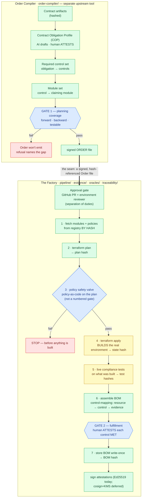
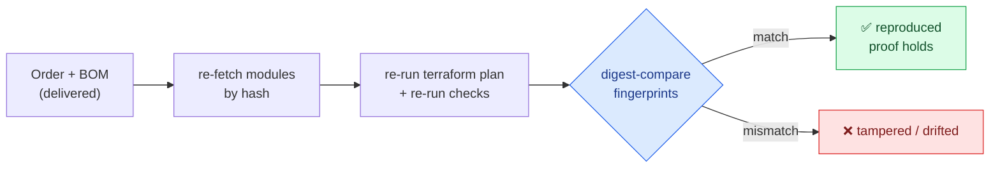
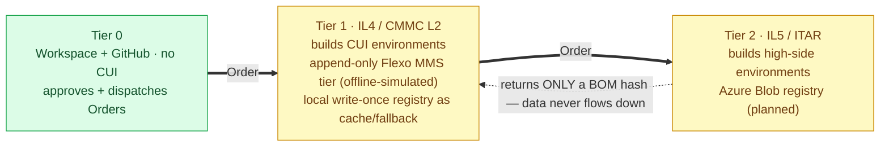

# Architecture

This is the developer-level summary of the system. It condenses the
[plain-English tour in `docs/v1/`](docs/v1/README.md) — each section links to the
tour doc that explains it from scratch. If a term is unfamiliar, the
[glossary](docs/v1/06-glossary.md) defines it.

> **Design of record (end-state).** This document describes the full target
> architecture. For what is _implemented today_ vs. deferred, see
> [`docs/AS-BUILT.md`](docs/AS-BUILT.md). In the diagrams, **🟩 green = runs
> today** and **🟨 amber = Phase II (mocked or deferred today)**. Every current
> run is fixture-backed and stamped **NON-EVIDENTIARY**.

## 1. The one big idea

_(Tour: [00 — What is this?](docs/v1/00-what-is-this.md))_

> **Building the secure environment and proving it's compliant are the same
> action.**

Compliance is not gathered after the fact by inspecting an existing setup — it
is a byproduct of provisioning. The environment is built from a signed,
policy-checked **Order**, and the proof (a content-addressed **BOM** that
doubles as the **SSP**) falls out of the build. If the build changes, the proof
changes with it.

## 2. The two systems and the seam

_(Tour: [00](docs/v1/00-what-is-this.md) · [01](docs/v1/01-the-order.md) · [02](docs/v1/02-the-factory.md))_

Two decoupled systems pass a single signed Order file between them. The
Compiler answers _"what must be true"_; the Factory _"make it true and prove
it."_ The seam is deliberate: Orders can be produced, reviewed, and
version-controlled independently, and the Factory's input is a signed Order
file and nothing else.

**Legend:** 🟩 runs today · 🟨 Phase II · 🔷 gate/check · 🟥 hard stop. Today the
Factory runs `terraform plan` at **preview level with mock providers** (no
cloud, no credentials); **apply and live compliance tests are Phase II**, and
evidence is fixture-backed (→ NON-EVIDENTIARY). Attestation signing is real
today (Ed25519); **cosign + FIPS-KMS is the deferred production signing path**.

There are exactly **two numbered gates** — Gate 1 (planning coverage, Compiler)
and Gate 2 (human attestation, Factory). The pre-apply policy check is a safety
valve, not a gate: it halts the line, but it doesn't decide compliance.

## 3. The Order — contract in, signed build order out

_(Tour: [01 — The Order](docs/v1/01-the-order.md))_

The Compiler turns a contract into a signed Order in four steps, with one human
judgment at the front:

1. **Contract → obligations (the COP).** A human, with AI drafting help,
   restates the contract as structured obligations ("handles CUI ⇒ CMMC L2",
   "US persons only", "data stays in the US"). A **Compliance Officer attests**
   the COP — the single human call in this machine. An obligation that would
   silently drop a requirement raises a spillover-review error instead.
2. **Obligations → controls.** Each obligation expands to the specific security
   controls it requires, resolved against the 110-control catalog
   (`ontology/cmmc-edit.ttl`).
3. **Controls → modules.** Each required control is matched to a **module** — a
   concrete piece of cloud setup (`structural/tier1.ttl`) that _claims_ to
   satisfy it and records _how the claim is checked_ (an oracle, a human
   review, or CSP-inherited).
4. **Gate 1 — cover everything or refuse.** Forward (every required control has
   a claiming module), backward (every module traces to a required control), no
   untestable claims. Any failure ⇒ the Order is refused **and the refusal
   names what's missing**. Pass ⇒ a signed Order: required controls, chosen
   modules, and SHA-256 fingerprints of its own contents.

"Signed" for the Order today means **fingerprinted** (hash-referenced,
tamper-evident). Attestation records, by contrast, carry a real cryptographic
signature: Ed25519 (`sig_algo=ed25519-v1`) via the `compliance_engine.signing`
package, verified at load and **failing closed on tamper**. The demo runs
`sig_algo=none` (git-trust) and remains NON-EVIDENTIARY; **cosign + FIPS-KMS
(`sig_algo=cosign-v1`) is the deferred production path**, and Rekor transparency
logging is deferred.

For the demo's NV012 contract: **22 required controls**, covered by **10
modules**, out of the 110-control catalog — the other 88 are out of this
Order's scope.

## 4. The Factory — execute the Order, gather the facts

_(Tour: [02 — The Factory](docs/v1/02-the-factory.md))_

The Factory (`pipeline/runner.py`, driven by `cli.py`) runs the Order through
an assembly line:

| Stage               | What it does                                                                     | Trust property                                  |
| ------------------- | -------------------------------------------------------------------------------- | ------------------------------------------------ |
| 1 · Load Order      | **re-computes** the Order's hashes and compares (never trusts them)              | nobody can edit the recipe after signing        |
| 2 · Fetch by hash   | pulls each module, re-derives its hash against the Order's expectation           | you build from exactly the promised blocks      |
| 3 · Plan            | **real `terraform plan`** over `terraform/tier1/` with **mock providers**        | a genuine machine-readable preview, no cloud    |
| 4 · Policy check    | policy-as-code over the plan (e.g. US-region residency); violation **halts**     | reads the actual plan, not a human's checkbox   |
| 5 · Apply           | mock today; Phase II builds the live environment                                 | —                                               |
| 6 · Collect evidence| machine-readable facts, each **addressing** the control(s) it is about           | fixture-backed today ⇒ stamped mock             |
| 7 · Run oracles     | per-control automated checks → pass / fail / **can't tell**                      | no fake checks: no criterion ⇒ `cantTell`       |

The output is a **run record, not a verdict**: the Factory never declares a
control MET. That call is the next section.

The hash re-derivation in stages 1–2 is intentionally **re-implemented** in the
Factory rather than imported from the Compiler — the two sides of the seam must
verify independently.

## 5. Machines check; only humans certify

_(Tour: [03 — Machines vs. humans](docs/v1/03-machine-vs-human.md) — the most important doc in the tour)_

- **Verification** = automated fact-checking (policy checks, oracles, hash
  matches, SPRS math). `earl:automatic`. Safe to delegate to an agent; safe to
  re-run.
- **Validation** = human judgment: the Affirming Official's MET / NOT-MET
  attestation; the Compliance Officer's COP attestation. `earl:manual`. Carries
  False Claims Act liability.

The vocabulary enforces the split: evidence **`ce:addresses`** a control (points
at it), oracles **`ce:evaluatesAgainst`** it (measure it) — **only a human
attestation `ce:attests`** it (marks it MET). This is wired into the data model,
not a convention.

Two consequences the system surfaces rather than hides:

- **Most METs are human, not machine-proven.** Only 7 controls have an oracle;
  the rest honestly return `cantTell`. The audit prints the split — demo:
  `4 MET-by-machine / 18 MET-by-human-only`.
- **The contradiction check.** A human attests MET while the machine oracle for
  that control **failed**, with no written override justification ⇒ flagged as
  a first-class contradiction in the audit and the SSP. An override
  justification clears it; silence does not.

An agent may drive the entire Factory and draft the COP; it can never attest.
Capability and accountability are separated by construction.

## 6. The proof — audit, SPRS, BOM, SSP

_(Tour: [04 — The proof](docs/v1/04-the-proof.md))_

Four outputs, all views over the same graph:

- **The audit** (`traceability/audit.py`): walks the chain **both directions**
  (forward: every required control implemented + attested; backward: every
  attestation backed by evidence addressing the right control), plus the
  contradiction list and the proven-vs-attested split.
- **The SPRS score** (`traceability/sprs.py`):
  `110 − Σ weight(controls not MET)`, computed over the **Order's required
  set**, MET taken from Gate-2 attestations only. POA&M legality is a hard
  gate: a 3/5-point (or excluded 1-point) control on a POA&M ⇒
  `valid_submission=False` regardless of score.
- **The BOM** (`traceability/bom.py` → `bom.json`): one row per required
  control — resources, evidence hashes, oracle outcome, attestation outcome,
  status. It **inherits the weakest evidentiary status** (any mock input ⇒ the
  whole BOM is `mock`) and is stored **write-once, content-addressed** in the
  registry.
- **The SSP** (`documents/ssp.py` → `ssp.md`): the government document with the
  110-row traceability matrix, compiled deterministically from the same graph —
  byte-stable, drift-checked (`--check`), and **structurally unable to omit**
  the NON-EVIDENTIARY banner when the run is mock.

### Re-executability (proof by reproduction)

The core claim: **an auditor doesn't have to trust you.** Given Order + BOM, a
C3PAO assessor re-fetches every artifact by hash, re-hashes to detect
tampering, re-runs the plan-level checks, and digest-compares:

Today the loop re-runs at **plan level**; live rebuild-and-compare is Phase II.
The step-by-step assessor procedure is [`docs/AUDITOR-GUIDE.md`](docs/AUDITOR-GUIDE.md).

## 7. The named-graph substrate (developer detail)

Everything is held as an `rdflib.Dataset` of named graphs, one per layer — the
audit, BOM, and SSP are all queries over this dataset, which is why they cannot
disagree with each other:

| Named graph         | Holds                                                  | Filled by                           |
| ------------------- | ------------------------------------------------------ | ----------------------------------- |
| `<ce:ontology>`     | the 110 `cmmc:` controls + obligation/derivation vocab | `ontology/`                         |
| `<ce:plan>`         | the SOP/Order process model                            | `pipeline/plan.ttl`                 |
| `<ce:structural>`   | module ↔ control allocation                            | `structural/`                       |
| `<ce:order>`        | the Order + its COP derivation (Gate 1 record)         | `order-compiler/`                   |
| `<ce:evidence>`     | plan/state/check/test artifacts, hashed                | Factory stages 2–6                  |
| `<ce:attestations>` | Affirming Official determinations (Gate 2)             | `traceability/attestation.py`       |
| `<ce:plan-execution>` | per-stage provenance (`p-plan`/`prov:` activities)   | `pipeline/plan_execution.py`        |
| `<ce:audit>`        | oracle assertions + bidirectional audit + SPRS         | `oracles/` + `traceability/`        |

The `<ce:plan>` graph now carries a **full-chain P-Plan provenance** model: the
whole chain — contract → obligations → controls → COP → Order → evidence →
oracle assertions → attestations → BOM/SSP — is expressed as p-plan Variables
realized by Entities, with an upstream `ce:SOP-ORDER-COMPILE` plan; `plan.ttl`
is extended accordingly and a `check_sop_adherence` deviation check flags
divergence (`traceability/provenance.py`). The signed **audit package** (`ce
package` / `ce verify-package`, `traceability/package.py`) builds and signs a
manifest over the BOM, SSP, audit + SPRS, this full-chain provenance, a
per-control control→attestation→signed-policy chain, and the signed-policy
inventory; `ce verify-package` re-verifies it offline (signature + artifact
re-hash + chain).

Component-by-component detail (predicates, files, what's real vs. deferred) is
in [`docs/AS-BUILT.md`](docs/AS-BUILT.md).

## 8. Tiered provisioning chain

Each tier provisions the next; sensitive data never flows _down_:

Phase I builds for **Tier 1 (IL4/CMMC L2)**. The append-only **Flexo MMS**
store backend is wired (`--store-backend flexo`, `pipeline/backends/flexo.py`)
as the remote tier of record, but is **offline-simulated** today via a
deterministic `FakeFlexoStore`; a live in-enclave Flexo server is deferred. The
**local write-once registry** serves as the cache/fallback tier. The GCS (Tier
1) and Azure Blob (Tier 2) backends remain planned, not built. Tier 2 returns
only a BOM hash to Tier 1 — the proof crosses the boundary, the CUI never does.

## 9. Bare now vs. bolted on later

- **Now:** bare SHA-256 (content identity); local write-once registry plus the
  wired append-only Flexo MMS backend (offline-simulated); real Ed25519
  attestation signing (fail-closed on tamper); the signed audit package (`ce
  package` / `ce verify-package`); mock provisioning + fixture evidence
  (NON-EVIDENTIARY).
- **Phase II:** live `terraform apply` + live compliance tests; real evidence
  collectors; a live in-enclave Flexo server; GCS/Azure registry backends;
  cosign + FIPS-KMS production signing (Rekor deferred, self-hosted if ever
  adopted) — required before a C3PAO re-executes.
- **Phase II+:** authority/credential model binding the Affirming Official's
  SPRS identity + role to each attestation.
